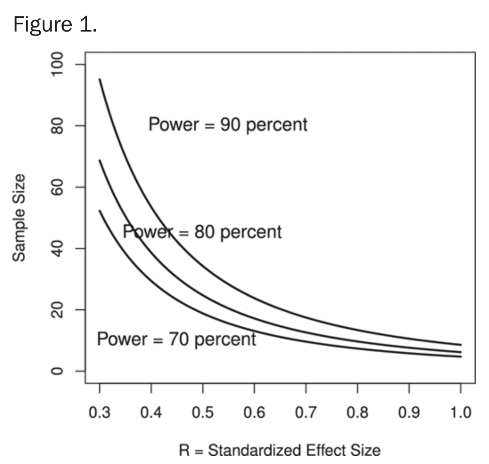
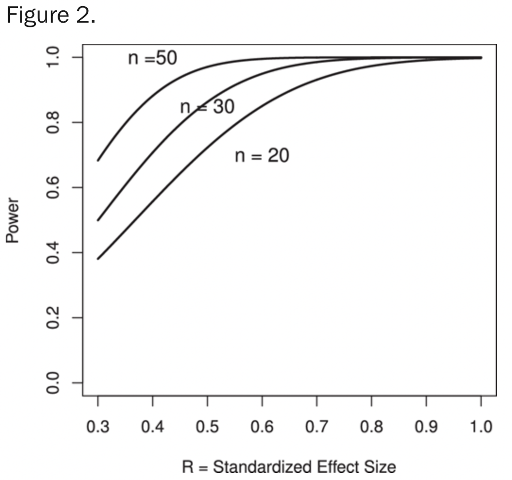

## Statistical Design of Experiments and Sample Size Selection Using Power Analysis

Abstract
Purpose: To provide information to visual scientists on how to optimally design experiments and how to select an appropriate sample size, which is often referred to as a power analysis.

Methods: Statistical guidelines are provided outlining good principles of experimental design, including replication, randomization, blocking or grouping of subjects, multifactorial design, and sequential approach to experimentation. In addition, principles of power analysis for calculating required sample size are outlined for different experimental designs and examples are given for calculating power and factors influencing it.

Results: The interaction between power, sample size and standardized effect size are shown. The following results are also provided: sample size increases with power, sample size increases with decreasing detectable difference, sample size increases proportionally to the variance, and two-sided tests, without preference as to whether the mean increases or decreases, require a larger sample size than one-sided tests.

Conclusions: This review outlines principles for good experimental design and methods for power analysis for typical sample size calculations that visual scientists encounter when designing experiments of normal and non-Gaussian sample distributions.

Sample size calculation is an important aspect of experimental design in data science. It refers to the process of determining the number of observations or replicates needed in a study in order to have sufficient statistical power to detect a meaningful difference or effect. The sample size is influenced by factors such as the desired level of precision, the variability of the data, and the effect size of the difference or relationship being studied. There are various statistical methods and formulas that can be used to calculate sample size, such as the power analysis.

This tutorial in the “Focus on Data” series provides information on how to optimally design experiments and how to select an appropriate sample size, which is often referred to as a power analysis. A power analysis is of great importance when planning an experiment that has a reasonably good chance of detecting treatment effects if they exist. In addition, the size of the effect anticipated should be of practical importance and the experimental design should ensure reproducibility of results. Funding agencies and journals consider rigor and reproducibility as major criteria for funding and publication. Sample size determination is an important tool for learning about what can be achieved in a study. There is much more to a power analysis than to justify grant proposals. It gives the investigator perspective on whether a well-designed experiment is feasible and likely to accept or refute a hypothesis based on an estimated measurement variability and the effect size that is anticipated. A well-considered power analysis to justify the sample size is an essential requirement for all studies. 
Designing a good experiment is not easy, as in the beginning there is much uncertainty. Although one may have a certain response in mind, it is uncertain how to best measure it. Factors that can affect the response may be anticipated, but there is usually uncertainty about the relevant level of each factor that should be tested and the optimal sampling interval for detecting a response. Also, some of the factors may interact in how they affect the response (for example, treatment effects may depend on age or sex), and the experimental design should make it possible to assess such interactions. Moreover, not every factor can be anticipated and incorporated into the experiment. A good experimental design with proper randomization can ensure that unanticipated, omitted factors will equally impact the treatments to be studied. 
When one designs an experiment, one usually knows very little about the measurement variability and the effect size. It would be so much easier if one already knew the results. Although it is certainly true that the best time to design an experiment is after the results of the experiment have come in, knowing this does not help design the experiment. What helps is understanding sound experimental design principles, access to pilot data, and knowing the relevant prior literature as it relates to the questions that are being studied. Fortunately, one usually does not start from the very beginning but can build on the research that has been carried out before.


## Good Principles of Experimental Design

Detailed discussions of important design principles can be found in books on the statistical design of experiments, such Box et al.,1 Ledolter and Swersey,2 and Montgomery.3 The seminal contributions of Fisher4 have shaped this field. The following are important statistical design principles: 
•Replication. Observing a certain result just once or twice does not make it reliable. Natural variability is present everywhere; results from repeated trials on the same subject vary, and results from trials on different subjects vary even more. Replicating the experiment increases the reliability and rigor of the results.
•Randomization. Allocation of treatments randomly to experimental subjects ensures the validity of an inference in the presence of unspecified disturbances by making certain that the risk of such disturbances is spread evenly among the treatment groups. For example, in visual science, this might entail assigning different treatments to groups of patients at random, or randomizing the order of an assigned treatment to a group of subjects or eyes. Without randomization, treatment differences may be confounded with other variables that are not controlled by the experimenter. Anticipating confounding variables in advance can help tremendously in randomizing subjects based on these variables, such as age, sex, animals from the same litter or cage, severity of disease, or level at baseline.
•Blocking. Randomizing the assignment of treatments to subjects or eyes is important as it spreads the existing variability among subjects equitably across all treatments. However, the experimenter can do considerably better if the experimental subjects can be grouped into blocks, such that units are homogenous within the same block, but different across blocks. In the visual sciences, eyes can be blocked by subjects, or in the case of mice, by cage or litter. Responses on eyes from different subjects vary considerably, whereas the responses on eyes from the same subject are usually related with much smaller variability. When studying effects, one frequently treats only one eye, whereas keeping the other eye as a within-subject control. This approach assumes that the treatment will only affect the eye that receives it, which may not be the case in every situation. If the effect is restricted to the treated eye, then the large subject effect that affects both eyes in a similar way can be removed, resulting in an increase of the precision of the comparison, potentially making it more sensitive to detecting an effect, if one exists. Also, it is more efficient to design the experiment such that each treatment is applied to the same subject (or eye) at different time points in which the effect of the first treatment is no longer present and will not affect the second treatment effect. The consecutive arrangement of the treatments can always be randomized to make sure that treatment effects are not compromised by the order. A within-subject comparison of the effectiveness of a treatment or a drug is subject to fewer interfering variables than a comparison across different subjects.
•A multifactor design should be considered, instead of a one factor at-a-time experimental approach. A common, but inefficient, approach to studying the effects of several factors is to carry out successive experiments in which the levels of each factor are changed one at-a-time. Fisher4 showed that a better approach is to vary the factors simultaneously and to study the response at each possible factor-level combination. Such approach makes it possible to learn about interaction effects (e.g., whether the effect on the response when changing one factor depends on the level of another factor).
•Sequential approach to experimentation. Each experiment contributes to one’s understanding. The results of one experiment are critical to determine the next experimental steps. Hence only a portion of the overall research plan and budget should be spent on the initial experiment.
In medical research, investigators run experiments all the time, and evidence-based medicine relies on randomized experiments to confirm which of several treatments are the most effective. 
The search for effective ways to design experiments and issues of sample size and statistical power are commonplace in scientific experimentation. If experiments are executed poorly, little, or even nothing, will be learned from the resulting data. Although it is true that most experiments increase knowledge (one usually learns “something” through experimentation), the experimenter wants to learn as efficiently as possible. Relatively few experimental runs (observations) are needed in efficient experimental designs to get precise estimates of the factor effects. Sir Ronald Fisher, the eminent statistician and scientist who developed this area, said that “a well-designed experiment may improve the precision of the results tenfold, for the same cost in time and labor” (Fisher,4 page 217).


## Power Analysis: Importance of Calculating the Required Sample Size

Prior to running an experiment, one needs to determine the sample size required to identify scientifically meaningful effects. In other words, one must address the question whether a certain sample size is sufficient to detect a specified response effect if it really exists. If the sample size is too small, observed effects may not be statistically significant and meaningful effects may not be uncovered, even if they do exist. Conversely, including too many samples when not necessary cannot only be a waste of resources, but can also expose subjects to unnecessary risks, and may reveal statistically significant, but clinically irrelevant, results. 
It is very important to know whether the data that are collected from an experiment have a realistic chance of detecting meaningful effects. Consider, for example, an experiment on mice that studies the effect of a new drug or genetic treatment on improving visual function. Typically one knows how large an effect will be considered clinically meaningful (e.g., a 30%–40% effect size for a promising new drug being tested in preclinical studies). Research studies are expensive, and costs increase with the number of subjects that need to be recruited into the study. Prior to running the experiment, one must calculate the statistical power of detecting (practically) meaningful effects. For some planned experiments, detection may not be feasible; many more subjects may be needed to learn about clinically important effects. If one cannot afford the required sample sizes, one must restructure or abandon the problem in favor of problems that can be solved with the budget at hand. If there is little chance that meaningful effects can be detected, resources are better expended elsewhere. Although medical grant proposals typically require a section on sample size and power, these sections are usually written in a defensive manner to justify the experimental plan the investigator has settled on a long time ago. Often these sections are written to defend a prior assumption the investigator has, and they rarely assess critically whether the planned research is worth its cost or whether the effect size is appropriate. Many times they represent an intricate “song and dance” to justify why limited funds can be used to study something experimenters want to study anyway. Experimenters need to understand that sample size studies are there to help them determine if a question can reasonably be answered; sample size studies are not there to game the system to achieve funding. 
Many statistics packages have modules for determining the appropriate sample sizes (see Appendix for some examples and links). Some programs are dedicated to this task exclusively, such as the sample size/power programs by Lenth.5 Lenth's sample size applets (they are free, good, and easy to use) cover many different situations, including continuous outcome variables (with an emphasis on means and variances), categorical outcome variables (with an emphasis on proportions), and correlations. G*Power, developed by Faul et al.,6,7 is another free software program available for both Macintosh and PC platforms. 
Statistical power is defined as the probability that a data-based test will correctly reject a false null hypothesis (e.g., the means of two distributions are equal). The higher the statistical power, the smaller the type II error of not rejecting a false null hypothesis (false-negative result). Incorporated into the power analysis is also the specified type I error (false-positive result) of rejecting the null hypothesis when the difference was really only due to chance alone. Statistical power can be thought of as the probability of finding a difference in population characteristics when such differences actually exist. Of course, power increases with the magnitude of the differences one wants to detect; it is easier for data-based tests to detect larger differences than smaller differences. Experiments with low statistical power may not uncover meaningful effects, even if they do exist. A minimum level of statistical power must be sought, at least 80% or greater, to detect a specified practically relevant difference. The choice of power (e.g., 80%, 90%) is related to how certain one wants to be that the experimental design (e.g., sample size) is sufficient to detect a meaningful difference if one does exist. In designing clinical trials, the Consolidated Standards of Reporting Trials (CONSORT) has an agreed on CONSORT Statement, which is an evidence-based, minimum set of recommendations for reporting randomized trials (http://www.consort-statement.org). It offers a standard way for authors to prepare reports of trial findings, facilitating their complete and transparent reporting, and aiding their critical appraisal and interpretation. Sample size calculation is one of the key requirements. 
Sample size selection for some typical problems that visual scientists encounter in their research are discussed next.8

## Power Analysis: Detecting a Difference from a Known Mean of a Single Normal Distribution (One-Sample Situation)
We test the null hypothesis H0 : μ = μ0 against the one-sided (lower-tailed) alternative hypothesis H1 : μ < μ0. We test the research hypothesis whether or not an intervention reduces the mean from its current known value μ0. When determining the appropriate sample size, we need to specify values for the four following items: 

• σ=Var(Y‾‾‾‾‾‾√), the SD (standard deviation = square root of the variance) of the normally distributed measurement variable Y. Prior data in the literature or pilot data provide a planning value for the SD.
• The significance level (that is, the probability of falsely rejecting a true null hypothesis); usually α = 0.05.
• The power (usually 0.80, or 80%) to detect a specified meaningful change (commonly referred to as effect size) δ = μ1 − μ0 < 0. β = 1 − Power (here β = 1 − 0.8 = 0.2) is the probability of a type II error of accepting the null hypothesis H0 if the mean has indeed shifted to μ1 = μ0 + δ < μ0.
Result: The required sample size for detecting a change δ with power 1 − β is 
n=(zα+zβ)2(σ/δ)2;



Plotting the required sample size against the standardized effect size (e.g., effect size divided by the SD of the measurements) for 5% significance level and 70%/80%/90% power. For anticipated larger effects, fewer samples are required, but if one is trying to achieve greater power (e.g., top line of 90% power), the required sample size increases.
The (result) equation involves five quantities, and the relationship between them can be displayed graphically in other ways. For example, for fixed sample size (and fixed significance level), the power can be graphed against the standardized effect size R. The graph in Figure 2 shows how power decreases for decreasing standardized effect size. 



Plotting the power against the standardized effect size R (e.g., effect size divided by the SD of the measurements) for 5% significance level and three different sample sizes (20, 30, 50). Power decreases for anticipated smaller effects, and power increases for larger sample sizes. Fixing power at 80%, for example, one can detect a change of 0.35 (SD) with 50 samples, a change of 0.45 (SD) with 30 samples, and a change of 0.56 (SD) with 20 samples.

Here is an example of a sample size determination function in Python for a t-test:

```
def sample_size_det_t_test2(d, s, alpha, power):
    for n in range(1, 1000):
        t_a = abs(stats.t.ppf(alpha, df=2 * (n - 1)))
        t = t_a - ((d / s) * (n / 2) ** 0.5)
        l = (1 - power) - stats.t.cdf(t, df=2 * (n - 1))
        if l > 0:
            return n, l
```

This function takes as input delta: the minimum detectable effect δ, sd: the best guess of σb, siglevel: the significance level α, power: the power 1 − β.
The function first calculates the critical value using the "t.ppf" function from the "scipy.stats" library, which is the inverse of the cumulative distribution function for the t-distribution.


## Conclusions

This review has covered typical sample size calculations that you may encounter when designing your experiments. We have omitted the comparison of proportions, the assessment of correlations, comparisons that involve more than two groups of one factor in the 1-way ANOVA setting, and studies involving two factors in the 2-way ANOVA setting. Guidelines have also been provided for power analyses of non-Gaussian sample distributions (e.g., nonparametric testing). Although technical details can get complicated quickly (for example, power calculations for the correlation coefficient make use of the Fisher’s z-transformation to normalize the distribution of the Pearson correlation coefficient; sample size in ANOVA models with more than two groups are usually powered for the maximum difference between means3), power analysis software is readily available (see Appendix). The book by Cohen16 is another source for formulas, tables, and much useful practical discussion. 


## References
1.
Box GEP, Hunter JS, Hunter WG. Statistics for Experimenters: Design, Innovation, and Discovery. 2nd ed. New York: Wiley & Sons; 2005.
2.
Ledolter J, Swersey A. Testing 1-2-3: Experimental Design with Applications in Marketing and Service Operations. Stanford, CA: Stanford University Press; 2007.
3.
Montgomery D . Design and Analysis of Experiments. 8th ed. New York: Wiley & Sons; 2012.
4.
Fisher RA . The Design of Experiments. Edinburgh: Oliver and Boyd, 1935 (various later editions, such as 9th ed). New York: Macmillan Publishing Company; 1971.
5.
Lenth RV . Java applets for power and sample size [Computer software]. 2006. Available at: http://www.stat.uiowa.edu/∼rlenth/Power. Accessed July 1, 2020.
6.
Faul F, Erdfelder E, Lang AG, Buchner A. G*Power 3: a flexible statistical power analysis program for the social, behavioral, and biomedical sciences. Behav Res Methods. 2007; 39: 175–191. [CrossRef] [PubMed]
7.
Faul F, Erdfelder E, Buchner A, Lang AG. Statistical power analyses using G*Power 3.1: tests for correlation and regression analyses. Behav Res Methods. 2009; 41: 1149–1160. [CrossRef] [PubMed]
8.
Ledolter J . Economic field experiments: comments on design efficiency, sample size and statistical power. J Econ Manag. 2013; 9: 271–290.
9.
Ledolter J, Kardon RH. Assessing trends in functional and structural characteristics: a survey of statistical methods with an example from ophthalmology. Trans Vis Sci Tech. 2018; 7(5): 34, https://doi.org/10.1167/tvst.7.5.34. [CrossRef]
10.
Van Belle G, Martin DC. Sample size as a function of coefficient of variation and ratio of means. Am Stat. 1993; 47: 165–167.
11.
Brus J, Heng JA, Polanía R. Weber's law: a mechanistic foundation after two centuries. Trends Cogn Sci. 2019; 23: 906–908. [CrossRef] [PubMed]
12.
Pardo-Vazquez JL, Castiñeiras-de Saa JR, Valente M, et al. The mechanistic foundation of Weber's law. Nat Neurosci. 2019; 22: 1493–1502. [CrossRef] [PubMed]
13.
Vollrath D, Yasumura D, Benchorin G, et al. Tyro3 modulates Mertk-associated retinal degeneration. PLoS Genet. 2015; 11: e1005723. [CrossRef] [PubMed]
14.
Ledolter J, Gramlich OW, Kardon RH. Focus on data: display of data. Invest Ophthalmol Vis Sci. 2020; 61(6): 25, https://doi.org/10.1167/iovs.61.6.25. [CrossRef] [PubMed]
15.
Lehmann EL . Nonparametrics: Statistical Methods Based on Ranks. Revised 1st ed. Upper Saddle River, NJ: Prentice Hall; 1998: 76–81.
16.
Cohen J . Statistical Power Analysis for the Behavioral Sciences. 2nd ed. Hillsdale, NJ: Lawrence Erlbaum Associates; 1988.
